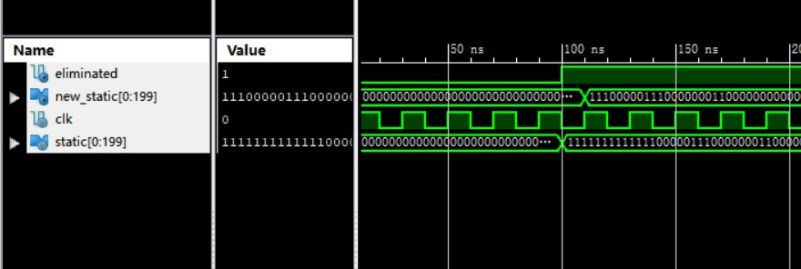

# RowEliminator 模块

### 功能用途

+ 判断当前格局有没有一行已经被填满了
+ 如果有的话，消除一行，返回新的格局
+ 注意，如果有多行需要同时消除的话，只需要消除一行即可
+ 由上一层判断消除多行

### 输入

+ clk 
+ [0:199] static

其中，clk 是时钟信号，而 static 表示当前的俄罗斯方块格局，总共 10 \* 20 的局面，对应于屏幕上，按照如下方式布局。

```
190 191 192 193 194 195 196 197 198 199
180 181 182 183 184 185 186 187 188 189
170 171 172 173 174 175 176 177 178 179
160 161 162 163 164 165 166 167 168 169
150 151 152 153 154 155 156 157 158 159
140 141 142 143 144 145 146 147 148 149
130 131 132 133 134 135 136 137 138 139
120 121 122 123 124 125 126 127 128 129
110 111 112 113 114 115 116 117 118 119
100 101 102 103 104 105 106 107 108 109
90  91  92  93  94  95  96  97  98  99
80  81  82  83  84  85  86  87  88  89
70  71  72  73  74  75  76  77  78  79
60  61  62  63  64  65  66  67  68  69
50  51  52  53  54  55  56  57  58  59
40  41  42  43  44  45  46  47  48  49
30  31  32  33  34  35  36  37  38  39
20  21  22  23  24  25  26  27  28  29
10  11  12  13  14  15  16  17  18  19 
0   1   2   3   4   5   6   7   8   9   
```

### 输出

+ eliminated
+ [0:199] new_static

eiliminated 输出是否有行被消了，new_static 表示消除一行的新格局。

### 代码

```verilog
`timescale 1ns / 1ps

module RowEliminator(
         input wire clk,
         input wire [0:199] static, // static blocks' status
         output wire eliminated, // 1 for one row eliminated
         output reg [0:199] new_static // after removing a complete row
       );

// ...
// 10  11  12  13  14  15  16  17  18  19 
// 0   1   2   3   4   5   6   7   8   9   

// full[0] 表示现在状态下最底下那一行有没有满
wire [19:0] full;

// 判断每行有没有满
genvar	i;
generate for(i = 0;i < 20;i = i + 1)
	begin : afor
		assign full[i] = & static[i*10:i*10+9];
	end
endgenerate

assign eliminated = |full;

// 从下往上找，找到一行满的就开始左移
always @(posedge clk) begin
  if (eliminated) begin
    if (full[0] == 1'b1)
      new_static <= static << 10;
    else if (full[1] == 1'b1) begin
      new_static[10:199] <= static[10:199] << 10;
      new_static[0:9] <= static[0:9];
    end else if (full[2] == 1'b1) begin
      new_static[20:199] <= static[20:199] << 10;
      new_static[0:19] <= static[0:19];
    end else if (full[3] == 1'b1) begin
      new_static[30:199] <= static[30:199] << 10;
      new_static[0:29] <= static[0:29];
    end else if (full[4] == 1'b1) begin
      new_static[40:199] <= static[40:199] << 10;
      new_static[0:39] <= static[0:39];
    end else if (full[5] == 1'b1) begin
      new_static[50:199] <= static[50:199] << 10;
      new_static[0:49] <= static[0:49];
    end else if (full[6] == 1'b1) begin
      new_static[60:199] <= static[60:199] << 10;
      new_static[0:59] <= static[0:59];
    end else if (full[7] == 1'b1) begin
      new_static[70:199] <= static[70:199] << 10;
      new_static[0:69] <= static[0:69];
    end else if (full[8] == 1'b1) begin
      new_static[80:199] <= static[80:199] << 10;
      new_static[0:79] <= static[0:79];
    end else if (full[9] == 1'b1) begin
      new_static[90:199] <= static[90:199] << 10;
      new_static[0:89] <= static[0:89];
    end else if (full[10] == 1'b1) begin
      new_static[100:199] <= static[100:199] << 10;
      new_static[0:99] <= static[0:99];
    end else if (full[11] == 1'b1) begin
      new_static[110:199] <= static[110:199] << 10;
      new_static[0:109] <= static[0:109];
    end else if (full[12] == 1'b1) begin
      new_static[120:199] <= static[120:199] << 10;
      new_static[0:119] <= static[0:119];
    end else if (full[13] == 1'b1) begin
      new_static[130:199] <= static[130:199] << 10;
      new_static[0:129] <= static[0:129];
    end else if (full[14] == 1'b1) begin
      new_static[140:199] <= static[140:199] << 10;
      new_static[0:139] <= static[0:139];
    end else if (full[15] == 1'b1) begin
      new_static[150:199] <= static[150:199] << 10;
      new_static[0:149] <= static[0:149];
    end else if (full[16] == 1'b1) begin
      new_static[160:199] <= static[160:199] << 10;
      new_static[0:159] <= static[0:159];
    end else if (full[17] == 1'b1) begin
      new_static[170:199] <= static[170:199] << 10;
      new_static[0:169] <= static[0:169];
    end else if (full[18] == 1'b1) begin
      new_static[180:199] <= static[180:199] << 10;
      new_static[0:179] <= static[0:179];
    end else if (full[19] == 1'b1) begin
      new_static[190:199] <= static[190:199] << 10;
      new_statc[0:189] <= static[0:189];
    end 
	end else 
    new_static <= static;
end

endmodule
```


### 仿真



